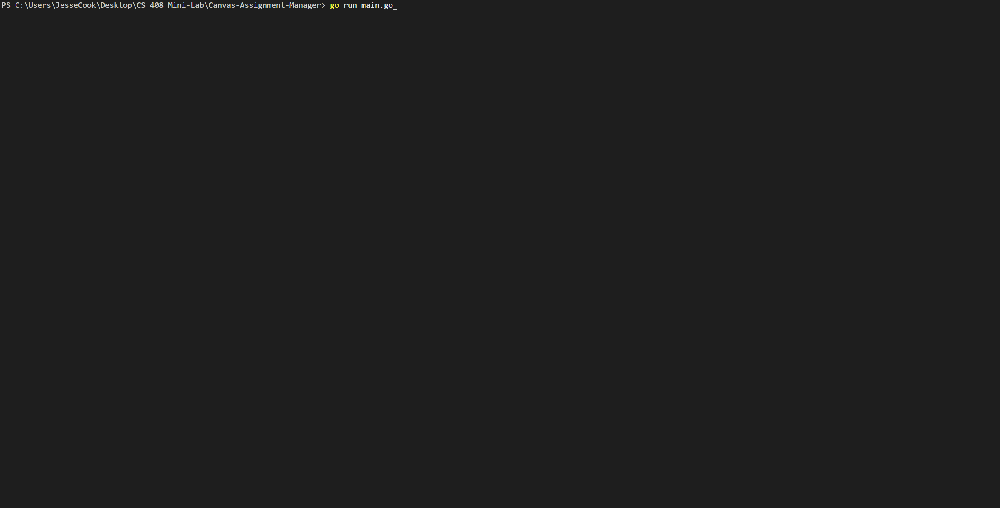
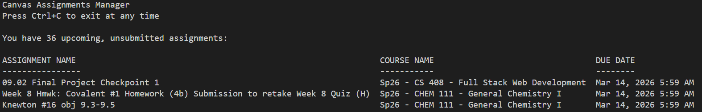
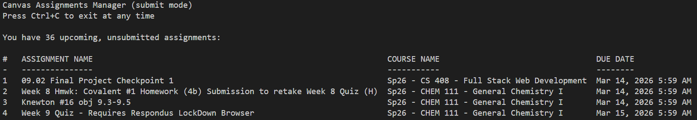

# Canvas Assignment Manager
This is a CLI tool that allows you to view and submit assignments to Canvas from the terminal. It is made with GO.

# Prerequistites
Git and GO programming languages must be installed before use, these provided links will guide you on obtaining them.

For Git:
https://git-scm.com/install/

For GO:
https://go.dev/dl/

# Setup Instructions
Clone and enter this repository with the following commands:

    git clone https://github.com/JesseCook93/Canvas-Assignment-Manager.git
    cd ./Canvas-Assignment-Manager

In that same directory, run this command to install a needed dependency:

    go get github.com/joho/godotenv

Next, a .env file needs to be created, open ".env.example" and follow the steps in that file.

Afterwards, you are ready to use this tool! Here are some usage commands to try from the cloned directory (Outputs will be different for you):

    go run main.go

Expected Output (Cropped):

    go run main.go -submit

Expected Output (Cropped):

# API Endpoints Used

| Method | Endpoint | Data Used or Sent |
|:---:|:---:|:---:|
| GET | /api/v1/courses | Course information is taken from here |
| GET | /api/v1/courses/:id/assignments | Assignment information is taken for each course  |
| POST | /api/v1/courses/:id/assignments/:id/submissions | When assignments are submitted, this is the endpoint used  |

# 2 Paragraph Reflection

This was an interest project. I had done class projects working with tokens for authentication, such as with a discord bot, but never before for an actual web API for a site I use everyday. It wasn't too challenging, as I used AI extensively for this since it was allowed and encouraged, but I did review it and make minor changes as I saw fit. That doesn't mean there weren't challenges I faced, such as being confused on why the regular canvas url was returning incorrect information. Turns out, the problem was that the url was wrong, and I had to use the BSU specific one in order to get the right information. There are some things I would like to improve about this project though.

If I had more time, I would change the output the most. It's very lackluster, and there are many ways it can be improved. I would make the assignment texts colored based on urgency. It would be very fitting and truly awaken the panic monster in all students seeing a due assignment in red text. I would also like to make it a GUI, but the requirements dictate it be CLI, so that is the way it will be. PS, a great professor should know that I used this tool to submit the assignment :)
